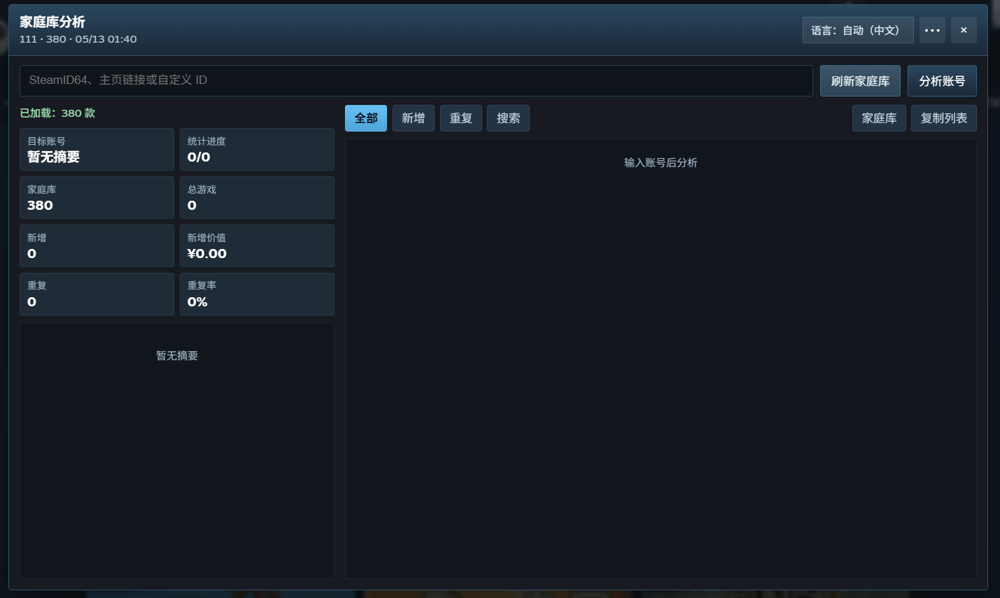

# Steam 家庭库分析器

一个 Tampermonkey 用户脚本，用来基于当前登录 Steam 账号的家庭组共享库，分析指定公开 Steam 账号加入后可能带来的新增游戏、重复游戏和新增价值。

## 截图

## 功能

- 读取当前账号的 Steam 家庭组共享库。
- 支持输入 SteamID64、`/profiles/<steamid64>`、`/id/<custom>` 或 vanity 名称。
- 支持在 `steamcommunity.com/profiles/<steamid64>` 页面自动填入当前资料页账号。
- 统计总游戏、家庭库、统计进度、新增、重复、重复率和新增价值。
- 列表包含全部、家庭库、新增、重复、搜索。
- 仅统计支持 Steam 家庭共享的游戏。
- 新增游戏原价按当前商店地区显示。
- 界面语言会跟随当前 Steam 页面语言，也可在右上角切换；金额格式会跟随商店地区。
- 支持表头排序、搜索、复制当前列表、复制报告和查看原始返回数据。
- 支持每 24 小时自动后台刷新家庭库，可在菜单中关闭。

## 安装

1. 安装 Tampermonkey。
2. 打开 GreasyFork 页面安装：
   <https://greasyfork.org/zh-CN/scripts/577825-steam-%E5%AE%B6%E5%BA%AD%E5%BA%93%E5%88%86%E6%9E%90%E5%99%A8>
3. Tampermonkey 会弹出安装页面，确认安装即可。

也可以直接从 GitHub 安装：

1. 打开脚本文件：
   <https://github.com/iMoonDay/steam-family-fit-analyzer/raw/main/script.user.js>
2. Tampermonkey 会弹出安装页面，确认安装即可。

## 使用

1. 登录 Steam 网页版。
2. 打开 `https://store.steampowered.com/` 或任意 `https://steamcommunity.com/profiles/<steamid64>` 页面。
3. 点击右侧的“家庭库分析”按钮。
4. 先点“刷新家庭库”。
5. 输入要分析的公开 Steam 账号，点击“分析账号”。

## 说明

- 目标账号的游戏详情必须公开，否则无法获取完整游戏库。
- 新增价值使用当前商店地区原价，不读取当前折扣价。
- 金额格式会根据商店地区显示。
- 免费、无价格、下架或区域不可售游戏会显示为 `N/A`。
- 脚本不绕过 Steam 隐私限制，也不需要手动输入 Steam Web API Key。

## 可调整配置

脚本开头保留了一组常量，可按需要修改：

- `FALLBACK_STORE_CC`：无法自动识别时使用的商店地区，默认 `CN`。
- `FALLBACK_STORE_LANG`：无法自动识别时使用的商店语言，默认 `schinese`。
- `APP_LOCALE`：界面语言默认模式，默认 `auto`，会跟随当前 Steam 页面语言，支持中文和英文；也可在右上角直接切换。
- `STORE_CACHE_TTL_MS`：商店条目缓存时间。
- `ORIGINAL_PRICE_BATCH_SIZE`：原价读取每批数量。
- `SHAREABILITY_BATCH_SIZE`：共享支持性检测每批数量。
- `STORE_REQUEST_DELAY_MS`：商店请求间隔。
- `AUTO_FAMILY_REFRESH_INTERVAL_MS`：自动刷新家庭库间隔。

## 授权

MIT License
