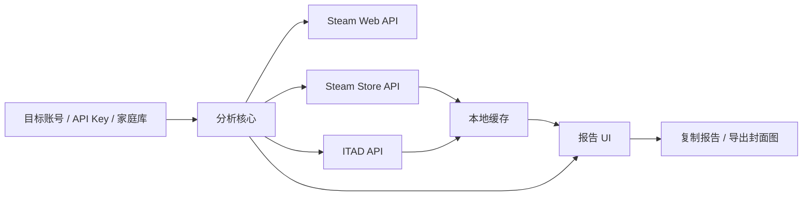

# 架构方案

## 技术选型

默认：Tauri。

- 前端：TypeScript + React 或 Svelte。
- 桌面命令层：Rust Tauri commands。
- 本地存储：SQLite + 文件缓存目录。
- 图片导出：前端 Canvas 优先；如果 WebView 表现不稳定，再迁移到 Rust 图像处理。

备选：Electron。

- 优点：Node 生态成熟，迁移前端和网络请求更直接。
- 代价：体积和运行内存更高，长期分发成本更大。

## 模块拆分

```text
desktop-tauri
  app shell
    window
    menu
    settings
  frontend
    views
    components
    report renderer
    poster renderer
  core
    analyzer
    classifier
    price model
    sort and filter
  services
    steam web api client
    steam store client
    itad client
    cover client
  storage
    config store
    sqlite repository
    cover blob cache
```

## 数据流



## 核心边界

- `core` 不直接发网络请求，只接收已经标准化的数据。
- `services` 只负责请求和标准化，不做 UI 排序和展示逻辑。
- `storage` 不决定业务口径，只保存和读取结构化数据。
- `frontend` 不直接拼接第三方 API URL，通过 Tauri commands 调用服务层。

## 建议命令接口

```ts
type AnalyzeInput = {
  targetInputs: string[];
  currentSteamId64: string;
  priceMode: "original" | "historyLow";
  locale: "auto" | "zh-CN" | "en";
  storeCountry: string;
};

type DesktopCommands = {
  analyze(input: AnalyzeInput): Promise<AnalysisReport>;
  refreshFamilyLibrary(): Promise<FamilyLibrary>;
  getSettings(): Promise<AppSettings>;
  saveSettings(settings: AppSettings): Promise<void>;
  clearStoreCache(): Promise<void>;
  clearCoverCache(): Promise<void>;
  exportPoster(input: PosterExportInput): Promise<string>;
};
```

## 登录与凭据

第一阶段建议采用显式输入：

- Steam Web API Key：用户填入，保存到系统安全存储或加密配置。
- ITAD API Key：用户填入，保存到系统安全存储或加密配置。
- 家庭库 access token：先提供手动粘贴入口，后续再做内置登录 WebView。

这样能先验证分析闭环，避免第一版被登录流程卡住。

